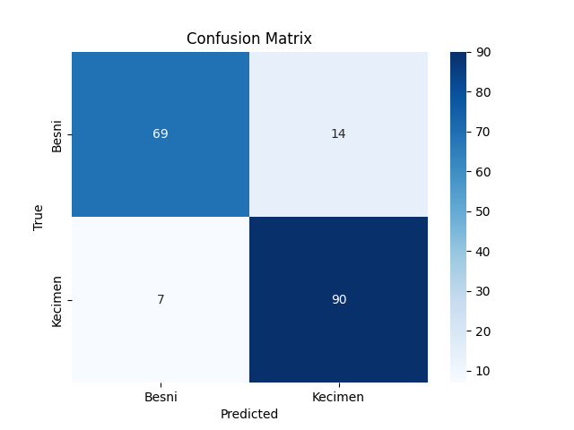

# 🍇 Raisin Classification (SVM)

This project classifies raisins into two categories, **Kecimen** and **Besni**, using Support Vector Machine (SVM) models with both RBF and linear kernels, with and without feature scaling.

---

## 📊 Dataset

- **Source:** [Raisin Dataset](https://www.muratkoklu.com/datasets/)  
- **Citation:** Cinar, I., Koklu, M., & Tasdemir, S. (2020). Classification of Raisin Grains Using Machine Vision and Artificial Intelligence Methods. *Gazi Journal of Engineering Sciences, 6*(3), 200-209. DOI: [10.30855/gmbd.2020.03.03](https://doi.org/10.30855/gmbd.2020.03.03)  
- **Features:** 7 numerical features (`Area`, `MajorAxisLength`, `MinorAxisLength`, `Eccentricity`, `ConvexArea`, `Extent`, `Perimeter`).  
- **Classes:**  
  - `Kecimen` → Kecimen raisin variety  
  - `Besni` → Besni raisin variety  

**Note:** Due to dataset licensing, the dataset file (`Raisin_Dataset.xlsx`) is **not included in this repo**. You can download it from [Murat Koklu's Dataset Page](https://www.muratkoklu.com/datasets/).

---

## 🚀 Project Workflow

1. **Data Preprocessing**
   - Loaded dataset using `pandas`.
   - Checked for missing values (none found).
   - Selected features: `Area`, `MajorAxisLength`, `MinorAxisLength`, `Eccentricity`, `ConvexArea`, `Extent`, `Perimeter`.
   - Split data into **train (80%)** and **test (20%)** using `train_test_split`.
   - Standardized features using `StandardScaler` for scaled models.

2. **Modeling**
   - Trained SVM models (`sklearn.svm.SVC`) with:
     - **RBF kernel** (with and without scaling).
     - **Linear kernel** (with and without scaling).
   - Used `Pipeline` API to streamline preprocessing and modeling for the RBF kernel with scaling.

3. **Evaluation**
   - Evaluated models using `classification_report` (precision, recall, f1-score, accuracy).
   - **Results:**
     - **RBF Kernel (No Scaling):** Accuracy = 0.83
     - **RBF Kernel (With Scaling):** Accuracy = 0.88
     - **Linear Kernel (No Scaling):** Accuracy = 0.91
     - **Linear Kernel (With Scaling):** Accuracy = 0.88
     - **Pipeline (RBF with Scaling):** Accuracy = 0.88
   - **Observation:** Linear kernel without scaling achieved the highest accuracy (0.91) but has higher computational cost compared to RBF.

---

## 📈 Confusion Matrix

Example of confusion matrix for the test set:



## 📈 Results Summary

| Model                     | Accuracy | Besni (F1-Score) | Kecimen (F1-Score) |
|---------------------------|----------|------------------|--------------------|
| RBF Kernel (No Scaling)   | 0.83     | 0.80             | 0.85               |
| RBF Kernel (With Scaling) | 0.88     | 0.87             | 0.90               |
| Linear Kernel (No Scaling)| 0.91     | 0.90             | 0.91               |
| Linear Kernel (With Scaling) | 0.88  | 0.87             | 0.89               |
| Pipeline (RBF + Scaling)  | 0.88     | 0.87             | 0.90               |

---

## ⚙️ Installation

1. Clone the repo:

```bash
git clone https://github.com/yourusername/raisin-classification-svm.git
cd raisin-classification-svm
```
2. **Install dependencies:**:   
```commandline
pip install -r requirements.txt
```
📂 Files in This Repo
- raisin_classification_svm.ipynb: Main notebook with all steps (EDA, preprocessing, modeling, evaluation).
- requirements.txt: Python dependencies.
- raisin_svm_pipeline.joblib
  
## 👨‍💻 Author

Yoseph Negash

📧 yosephn22@gmail.com

📅 2025
